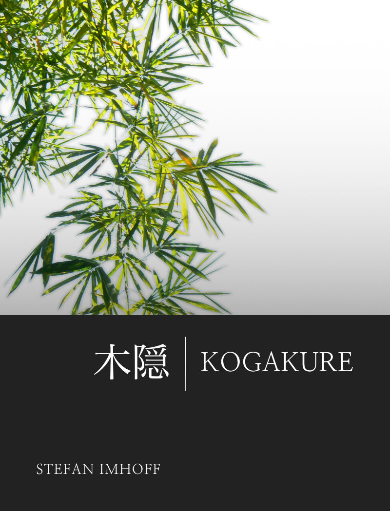

# KOGAKURE (木隠)

Ein Buch über Ninja und Ninjutsu

Ein Buch von [Stefan Imhoff](https://stefanimhoff.de). Mit Übersetzungen einiger Texte von *Peter Carlsson*. Das Foto *Bamboo* für das Cover ist von [*David Chilstrom*](https://www.flickr.com/photos/chilstrom/299326607/).

---

## Vorwort

Dieses Buch und die dazugehörende Website [kogakure.de](https://kogakure.de) gibt es nur, weil vor fast 18 Jahren zwei Dinge zur gleichen Zeit aufeinander trafen: Mein Interesse für Ninjutsu und mein Interesse für Webdesign.

Als ich in den 90ern zum ersten Mal mit Ninjutsu in Kontakt kam, war Information sehr schwer zu finden. Dōjō gab es nur sehr spärlich im deutschen Raum, keines davon in Reichweite für mich. Bücher gab es kaum, und die wenigen Bücher, die es gab waren sehr schwer zu beschaffen (ich musste im Voraus bezahlen, ohne sie je gesehen zu haben und wochen- oder gar monatelang auf die Lieferung warten). Ich habe damals jede Information, die mir in die Hände fiel gesammelt und mir Notizen gemacht. Diese Notizensammlung wurde das, was heute die Website [kogakure.de](https://kogakure.de) ist.

Für dieses Buch habe ich den Inhalt der Website noch einmal komplett überarbeitet, Fehler korrigiert, Fotos und Grafiken (wenn möglich) ausgetauscht und wo immer möglich auf Vektorgrafiken umgestellt.

Ich verwende die Hepburn-Schreibweise für japanische Worte, mit Ausnahme einiger weniger Begriffe, die so alltäglich sind (z. B. Ninja, Ninjutsu oder Samurai). Wenn ein Begriff unklar ist, findest du mit Sicherheit einen Eintrag im Glossar, der näher beschreibt, um was es sich handelt.

---

## Inhalt

### Geschichte

Dieses Kapitel enthält Abschnitte über die Entstehung von Ninja und Ninjutsu, Kampfschulen, Biografien, die größten und bekanntesten Schulen, Geschichten über Konflikte im Kernland der Ninja, den Niedergang der Ninja sowie neuere Geschichte.

### Organisation und Ausbildung

In diesem Kapitel geht es um die Struktur innerhalb einer Ninja-Schule und die Ausbildung der Ninja.

### Körperliches Training

Alles über die körperlichen Fähigkeiten, die Kampfstellungen, Fallschule, Schleichtechniken und ähnliche Themen sind in diesem Kapitel zu finden.

### Waffen und Werkzeuge

Die Ninja hatten ein riesiges Arsenal an Waffen, Ausrüstungen, Giften, Heilmitteln und Nahrungsmitteln, das ich in diesem Kapitel näher beleuchte.

### Geistige Kräfte

In diesem Kapitel beschreibe ich die geistigen Kräfte der Ninja, philosophische und religöse Konzepte der Ninja.

### Strategie und Taktik

Die Zahlreichen Strategien der Spionage, Kriegführung, Fluchttechniken, Techniken des Versteckens und Verkleidens werden in diesem Kapitel näher beleuchtet.

### Das Erbe der Ninja

Die Biografien der Großmeister Takamatsu und Hatsumi, die Organisation Bujinkan, sowie die 9 Schulen des Bujinkan werden hier näher beschrieben.

### Regeln und Philosophien

In diesem Kapitel werden zum Abschluss noch ein paar Regeln und Philosophien beschrieben.

### Anhänge

Die Anhänge enthalten eine Chronologie der Website kogakure.de, von ihrer Entstehung bis in die Gegenward, inklusive Screenshots des Designs alter Versionen. Außerdem ein Abschnitt mit Buch- und Film-Empfehlugen und das Glossar, was über 500 Worte aus dem Bereich von Ninjutsu und Kampfkunst enthält.

---

### eBook herunterladen oder online lesen

-   `.pdf`
-   `.mobi`
-   `.epub`

<https://github.com/kogakure/book-kogakure/releases>

### Korrekturen, Beteiligung, Übersetzungen

-   Hast du einen Fehler entdeckt? Grammatik, Rechtschreibung, Inhaltlich falsch?
-   Möchtest du Inhalte beisteuern? Glaubst du, dass ein Thema auf Website und Buch fehlt? Schlag es vor, vielleicht gefällt es mir.
-   Bist du ein Illustrator, Künstler oder ähnliches? Hast du Interesse, ältere Grafiken (z. B. Waffen oder Techniken) durch Illustrationen zu ersetzen?
-   Beherrschst du eine andere Sprache? Hast du interesse Interesse, eine Übersetzung in eine andere Sprache zu erstellen?

<https://github.com/kogakure/book-kogakure/issues>

---

Dieses Buch ist unter [Creative Commons](https://creativecommons.org/licenses/by-nc/4.0/deed.de) lizensiert.
